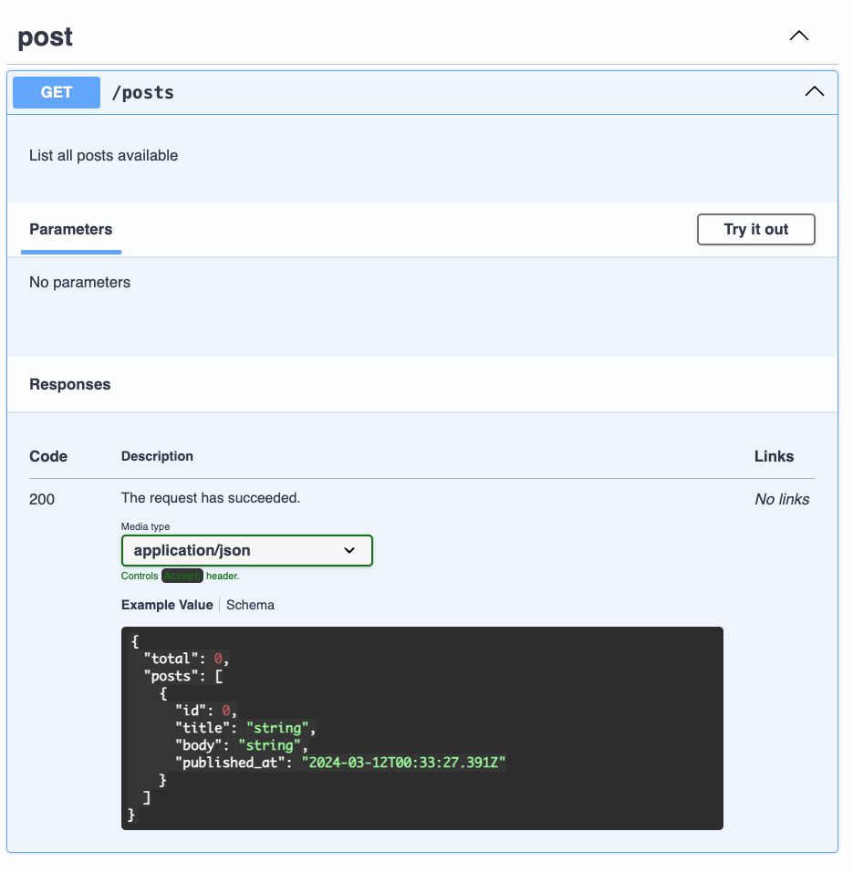

# Building Type Safe APIs

---

# Building Type Safe APIs\*

## With Rails

---

# Building Type Safe APIs\*

## With Rails\*

### _(When You Can't Use GraphQL)_

---

# Why?

- Public API that needs end-user documentation
- Different client / server teams (JS / Ruby)
- Stakeholder communication

---

# Making Your API "Type Safe"

- Generate an OpenAPI specification
- Validate requests and responses
- Generate clients in target language(s)

---

# OpenAPI

> The OpenAPI Specification provides a formal standard for describing HTTP APIs.

https://www.openapis.org/

---

# Documenting Endpoints

## With OpenAPI

---



---

# By Hand (YAML)

```yaml
paths:
  /posts:
    get:
      tags:
        - post
      operationId: post-list
      description: List all posts available
      parameters: []
      responses:
        "200":
          description: The request has succeeded.
          content:
            application/json:
              schema:
                type: object
                properties:
                  total:
                    type: integer
                  posts:
                    type: array
                    items:
                      type: object
                      properties:
                        id:
                          type: number
                        title:
                          type: string
                        body:
                          type: string
                        published_at:
                          type: string
                          format: date-time
                          nullable: true
```

---

# Using Framework Tooling

## ([Nest.js][nestjs-swagger])

[nestjs-swagger]: https://docs.nestjs.com/openapi/introduction

---

```typescript
type ID = number;

export class Post {
  @ApiProperty()
  id: ID;

  @ApiProperty()
  title: string;

  @ApiProperty()
  body: string;

  @ApiProperty({ format: "date-time", nullable: true })
  published_at: string | null;
}

@ApiExtraModels(Post)
class Posts {
  @ApiProperty()
  total: number;

  @ApiProperty({ allOf: [{ $ref: getSchemaPath(Post) }] })
  posts: Array<Post>;
}

@Controller("posts")
@ApiTags("post")
export class PostsController {
  @Get()
  @ApiOperation({
    operationId: "posts-list",
    description: "List all posts available",
  })
  @ApiResponse({ status: 200, description: "OK", type: Posts })
  async index(): Promise<Posts> {
    // return { total: 0, posts: [] };
  }
}
```

---

# Using Framework Tooling

## [rswag][] (Ruby)

[rswag]: https://github.com/rswag/rswag

---

```ruby
require 'swagger_helper'

describe 'Blog API' do
  path '/blogs' do
    get 'Fetch all posts' do
      tags 'post'
      consumes 'application/json'

      response '200', 'blog found' do
        schema({
          type: :object,
          properties: {
            total: {type: :integer},
            posts: {
              type: :array,
              items: {
                type: :object,
                properties: {
                  id: { type: :integer },
                  title: { type: :string },
                  body: { type: :string },
                  published_at: {type: :string, format: 'date-time', nullable: true}
                }
                required: [ 'id', 'title', 'body', 'published_at' ]
              }
            }
          },
          required: [ 'total', 'posts' ]
        })

        create(:post, title: 'Title', body: 'Body')
        run_test!
      end
    end
  end
end
```

---

# Validation

The [committee gem][committee] is a collection of middlewares that you can use to validate requests and responses to ensure they conform to your specification.

https://github.com/interagent/committee

[committee]: [https://github.com/interagent/committee]

---

# Incoming

```ruby
# config/application.rb

config.middleware.use Committee::Middleware::RequestValidation,
                      schema_path: Rails.root.join('path', 'to', 'openapi.yaml'),
                      strict_reference_validation: true, # Raise if we cannot resolve a `$ref`
                      coerce_date_times: true, # Convert date-time strings to native types
                      strict: true # HTTP 404 on undefined route in spec
```

---

# Outgoing

```ruby
# config/application.rb

unless Rails.env.production?
  config.middleware.use Committee::Middleware::ResponseValidation,
                        schema_path: Rails.root.join('path', 'to', 'openapi.yaml'),
                        strict_reference_validation: true,
                        validate_success_only: false, # Check non-2xx responses against spec
                        strict: true # Respond with 500 if response does not match spec
end
```

---

# And that works pretty well ...

---

# ... except ...

---

# ... it's a total pain in the :peach:

---

# Why Even Have Computers?

- How can I manage a 5000+ line spec file by hand?
- Why do I need to embed OpenAPI internals in my code?

---


---

# TypeSpec

> Describe your data up front and generate schemas, API specifications, client / server code, docs, and more.

https://typespec.io/

---

TypeSpec is to APIs as TypeScript is to code

---

# [Service Definition][playground-basic]

<div class="columns">
  <div>

```typespec
import "@typespec/http";
import "@typespec/openapi";

using TypeSpec.Http;

model Posts {
  total: int32;
  posts: Array<{
    id: int32;
    title: string;
    body: string;
    published_at: utcDateTime | null;
  }>;
}

@service
namespace BlogService {
  @route("posts")
  @get
  op list(): Posts;
}
```

  </div>
  <div>

```yaml
paths:
  /posts:
    get:
      operationId: list
      parameters: []
      responses:
        "200":
          description: The request has succeeded.
          content:
            application/json:
              schema:
                $ref: "#/components/schemas/Posts"
components:
  schemas:
    Posts:
      type: object
      required:
        - total
        - posts
      properties:
        total:
          type: integer
          format: int32
        posts:
          type: array
          items:
            type: object
            properties:
              id:
                type: integer
                format: int32
              title:
                type: string
              body:
                type: string
              published_at:
                type: string
                format: date-time
                nullable: true
            required:
              - id
              - title
              - body
              - published_at
```

  </div>
</div>

---

# Unlocking the Power of TypeSpec

---

# [String Aliases][playground-advanced]

<div class="columns">
  <div>

```typespec
@format("uuid")
scalar UUID extends string;

@format("email")
scalar Email extends string;

@format("uri")
scalar URI extends string;
```

  </div>
  <div>

```yaml
components:
  schemas:
    Email:
      type: string
      format: email
    URI:
      type: string
      format: uri
    UUID:
      type: string
      format: uuid
```

  </div>
</div>

---

# [Using Aliases][playground-advanced]

<div class="columns">
  <div>

```typespec
model User {
  id: UUID;
  email: Email;
  website_uri: URI;
}
```

  </div>
  <div>

```yaml
components:
  schemas:
    User:
      type: object
      required:
        - id
        - email
        - website_uri
      properties:
        id:
          $ref: "#/components/schemas/UUID"
        email:
          $ref: "#/components/schemas/Email"
        website_uri:
          $ref: "#/components/schemas/URI"
```

  </div>
</div>

---

# Union Types

```typespec
alias HTTPSuccessStatus = 200 | 201;
alias HTTPFailureStatus = 400 | 401 | 403 | 404 | 422;
```

---

# [Custom Error Responses][playground-advanced]

<div class="columns">
  <div>

```typespec
using TypeSpec.OpenAPI;
using TypeSpec.Http;

@error
model Error {
  message: string;
}

// Responses
model HTTPSuccessResponse<Code extends HTTPSuccessStatus, T> {
  @statusCode _: Code;
  @body body: T;
}

model HTTPFailureResponse<Code extends HTTPFailureStatus> {
  @statusCode _: Code;
  @body body: Error;
}

model OK<T> is HTTPSuccessResponse<200, T>;
model Created<T> is HTTPSuccessResponse<201, T>;
model Unauthorized is HTTPFailureResponse<401>;
model NotFound is HTTPFailureResponse<404>;

@service
namespace UsersService {
  @route("users/{id}")
  @get
  op fetch(id: UUID): OK<User> | NotFound | Unauthorized;
}
```

  </div>
  <div>

```yaml
paths:
  /users/{id}:
    get:
      operationId: fetch
      parameters:
        - name: id
          in: path
          required: true
          schema:
            $ref: "#/components/schemas/UUID"
      responses:
        "200":
          description: The request has succeeded.
          content:
            application/json:
              schema:
                $ref: "#/components/schemas/User"
        "401":
          description: Access is unauthorized.
          content:
            application/json:
              schema:
                $ref: "#/components/schemas/Error"
        "404":
          description: The server cannot find the requested resource.
          content:
            application/json:
              schema:
                $ref: "#/components/schemas/Error"
```

  </div>
</div>

---

# [Putting it All Together][demo]

[demo]: https://github.com/reagent/blog-openapi

---

# Additional Resources

- [TypeSpec Playground](https://typespec.io/playground)
  - [Blog service example][playground-basic]
  - [Service with failure modes][playground-advanced]
- [OpenAPI (Swagger) Editor](https://marketplace.visualstudio.com/items?itemName=42Crunch.vscode-openapi) - VSCode Plugin
- [`additionalProperties` support in TypeSpec](https://typespec.io/docs/getting-started/typespec-for-openapi-dev#additionalproperties)
- [`@jsonExample` decorator support](https://github.com/microsoft/typespec/issues/2700)

[playground-basic]: https://typespec.io/playground?c=aW1wb3J0ICJAdHlwZXNwZWMvaHR0cCI7CtIZb3BlbmFwaSI7Cgp1c2luZyBUeXBlU3BlYy5IdHRwOwoKbW9kZWwgUG9zdHMgewogIHRvdGFsOiBpbnQzMjsKICBwxBo6IEFycmF5PMQhICBpZMsgICB0aXRsZTogc3RyaW5nxhNib2R5zhJwdWJsaXNoZWRfYXQ6IHV0Y0RhdGVUaW1lIHwgbnVsbMQmfT47Cn0KCkBzZXJ2aWNlCm5hbWVzcGFjZSBCbG9nU8YW5QClQHJvdXRlKCLlAJ0iKcQSZ2V0CiAgb3AgbGlzdCgpOuYA0zsKfQ%3D%3D&e=%40typespec%2Fopenapi3&options=%7B%7D
[playground-advanced]: https://typespec.io/playground?c=aW1wb3J0ICJAdHlwZXNwZWMvb3BlbmFwaSI7CtIcaHR0cCI7CgovLyDEC3M6Ly9qc29uLXNjaGVtYS5vcmcvdW5kZXJzdGFuZGluZy3LHi9yZWZlcmVuY2Uvc3RyaW5nI2J1aWx0LWluLWZvcm1hdHMKQMYJKCJ1dWlkIikKc2NhbGFyIFVVSUQgZXh0ZW5kcyDGPDsKyi1lbWFpbMouRcQP2y91cmnLW1JJ0ittb2RlbCBVc2VyIHsKICBpZDrlAIM7CiAgxWw6xmTEEHdlYnNpdGVfdXJpOsRNOwp95QEeVW5pb25zCmFsaWFzIEhUVFBTdWNjZXNzU3RhdHVzID0gMjAwIHwgMjAxO8slRmFpbHVyZcklNMUlNDAxxQYzxQY0xAYyMjsKCnVzaW5nIFR5cGVTcGVjLk9wZW5BUEk70BhIdHRw5AEAZXJyb3LnANxFxAzlAN1tZXNzYWdlOukA%2FuYAwFJlc3BvbnNlc8cx6wDDyBs8Q29kZekBPfEA5CwgVD7FYkBzxRDFLl86IMQI5AE6QGJvZHkgxAU6IFTFd8pq5wEI2mrtASnfZ8pn5QD2y2tPSzxUPiBp7QC9yXQyMDDkAMM7xyxDcmVhdGVk3TExzDFVbmF1dGhvcml6ZWTIM%2FAA2DQwMckwTm90Rm91btssND7kAcdzZXJ2aWNlCm5hbWVzcGFjZeUCqXNTxhfmAQtyb3V0ZSgidcQZL3tpZH0iKcQXZ2V0CiAgb3AgZmV0Y2go6ALYKTrkAQrERj4gfOoAiHztAMPkATc%3D&e=%40typespec%2Fopenapi3&options=%7B%7D
