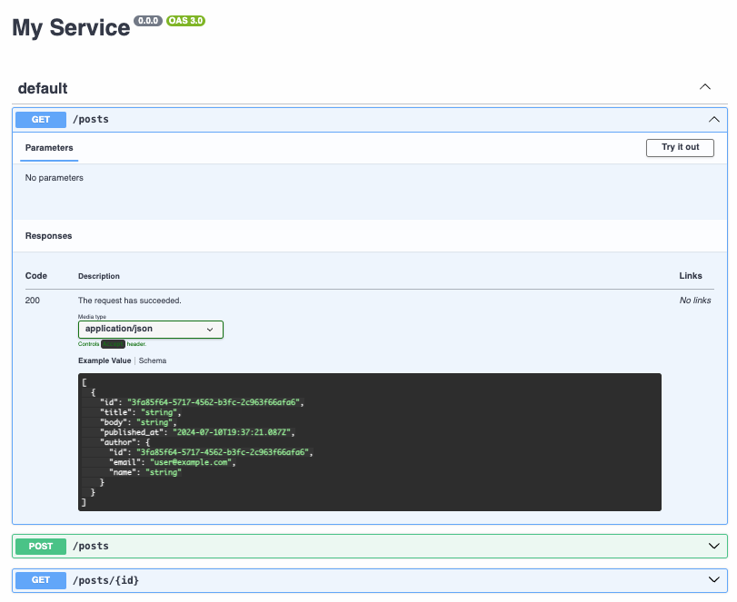
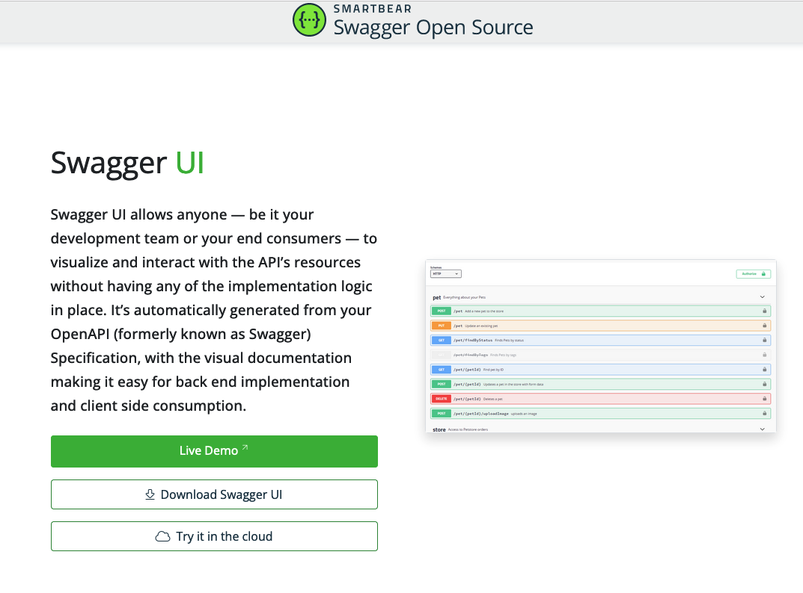
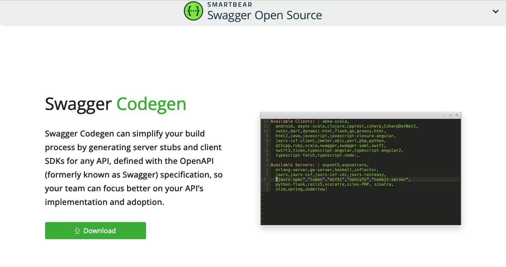
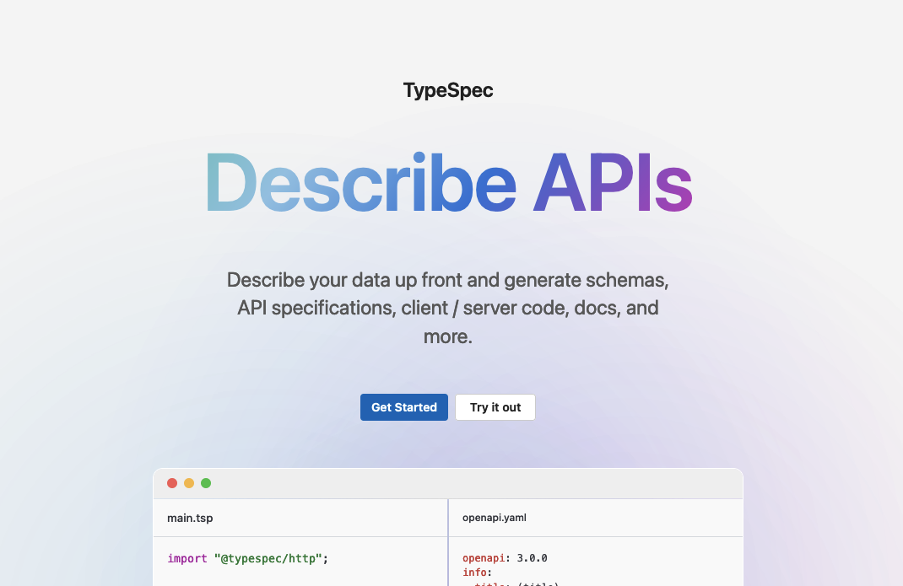

# Schema-First API Development

---

# What is an API Schema?

- Describes the operations and structure of your API
- Used as the source of truth for exposing HTTP services

---

# OpenAPI (aka Swagger)

> The [OpenAPI Specification][] provides a formal standard for describing HTTP APIs.

---

# Why?

---

# Generate Client Code

<div class="columns">
  <div>

```typescript
export interface Post {
  id: Uuid;
  title: string;
  body: string;
  /** @format date-time */
  published_at?: string;
  author: User;
}

export interface User {
  id: Uuid;
  email: Email;
  name?: string;
}

/** @format email */
export type Email = string;

/** @format uuid */
export type Uuid = string;
```

  </div>
  <div>

```typescript
/**
 * @title My Service
 * @version 0.0.0
 */
export class Api<
  SecurityDataType extends unknown
> extends HttpClient<SecurityDataType> {
  posts = {
    /**
     * No description
     *
     * @name PostsList
     * @request GET:/posts
     */
    postsList: (params: RequestParams = {}) =>
      this.request<Post[], any>({
        path: `/posts`,
        method: "GET",
        format: "json",
        ...params,
      }),

    /**
     * No description
     *
     * @name PostsCreate
     * @request POST:/posts
     */
    postsCreate: (
      data: {
        post: Post;
      },
      params: RequestParams = {}
    ) =>
      this.request<
        Post,
        {
          message: string;
        }
      >({
        path: `/posts`,
        method: "POST",
        body: data,
        type: ContentType.Json,
        format: "json",
        ...params,
      }),

    /**
     * No description
     *
     * @name PostsFetch
     * @request GET:/posts/{id}
     */
    postsFetch: (id: Uuid, params: RequestParams = {}) =>
      this.request<
        Post,
        {
          message: string;
        }
      >({
        path: `/posts/${id}`,
        method: "GET",
        format: "json",
        ...params,
      }),
  };
}
```

</div>

---

# Provide Documentation



---

# Validate Interactions

---

# [interagent/committee][]

> A collection of middleware to help build services with JSON Schema, OpenAPI 2, OpenAPI 3.

---

# Incoming

```ruby
# config/application.rb

config.middleware.use Committee::Middleware::RequestValidation,
                      schema_path: Rails.root.join('path', 'to', 'openapi.yaml'),
                      strict_reference_validation: true, # Raise if we cannot resolve a `$ref`
                      coerce_date_times: true, # Convert date-time strings to native types
                      strict: true # HTTP 404 on undefined route in spec
```

---

# Outgoing

```ruby
# config/application.rb

unless Rails.env.production?
  config.middleware.use Committee::Middleware::ResponseValidation,
                        schema_path: Rails.root.join('path', 'to', 'openapi.yaml'),
                        strict_reference_validation: true,
                        validate_success_only: false, # Check non-2xx responses against spec
                        strict: true # Respond with 500 if response does not match spec
end
```

---

# How?

- Create a machine-readable specification
- Publish for consumption

---

# What Can I Do With This?

---

# Generate Documentation

---



---

# Tooling

- [Swagger Codegen][swagger-codegen]
- [Swagger UI][swagger-ui]
- [OpenAPI Editor for VSCode][vscode-openapi]

---

# Generate Client Libraries

---



---

# Tooling

- [Swagger Codegen][swagger-codegen]
- [swagger-typescript-api][]
- [openapi-zod-client][]
- [openapi-generator][openapi-generator]

---

# Life is Good, Right?

---

# But ...

---

# Have you tried to edit an OpenAPI spec by hand?

---

<div class="columns">
  <div>

```yaml
paths:
  /posts:
    get:
      operationId: posts-list
      parameters: []
      responses:
        "200":
          description: The request has succeeded.
          content:
            application/json:
              schema:
                type: array
                items:
                  $ref: "#/components/schemas/Post"
    post:
      operationId: posts-create
      parameters: []
      responses:
        "201":
          description: The request has succeeded and a new resource has been created as a result.
          content:
            application/json:
              schema:
                $ref: "#/components/schemas/Post"
        "422":
          description: Client error
          content:
            application/json:
              schema:
                type: object
                properties:
                  message:
                    type: string
                required:
                  - message
      requestBody:
        required: true
        content:
          application/json:
            schema:
              type: object
              properties:
                post:
                  $ref: "#/components/schemas/Post"
              required:
                - post
  /posts/{id}:
    get:
      operationId: posts-fetch
      parameters:
        - name: id
          in: path
          required: true
          schema:
            $ref: "#/components/schemas/uuid"
      responses:
        "200":
          description: The request has succeeded.
          content:
            application/json:
              schema:
                $ref: "#/components/schemas/Post"
        "404":
          description: The server cannot find the requested resource.
          content:
            application/json:
              schema:
                type: object
                properties:
                  message:
                    type: string
                required:
                  - message
```

  </div>
  <div>

```yaml
components:
  schemas:
    Post:
      type: object
      required:
        - id
        - title
        - body
        - author
      properties:
        id:
          $ref: "#/components/schemas/uuid"
        title:
          type: string
        body:
          type: string
        published_at:
          type: string
          format: date-time
        author:
          $ref: "#/components/schemas/User"
    User:
      type: object
      required:
        - id
        - email
      properties:
        id:
          $ref: "#/components/schemas/uuid"
        email:
          $ref: "#/components/schemas/email"
        name:
          type: string
    email:
      type: string
      format: email
    uuid:
      type: string
      format: uuid
```

  </div>
</div>

---

# When it's 6000+ lines long?

---

# You're in for a bad time ...

---

# Can we automate this?

---

# Tooling in Ruby

---

# Code-First

---

# [swagger_blocks][swagger_blocks]

<div class="columns">
  <div>

- Code-first approach to defining a schema ✅
- Requires knowledge of OpenAPI syntax ❌
- Object re-use is not obvious 🤷🏻‍♂️

  </div>
  <div>

```ruby
class PetsController < ActionController::Base
  include Swagger::Blocks

  swagger_path '/pets/{id}' do
    operation :get do
      key :summary, 'Find Pet by ID'
      key :description, 'Returns a single pet if the user has access'
      key :operationId, 'findPetById'
      key :tags, [
        'pet'
      ]
      parameter do
        key :name, :id
        key :in, :path
        key :description, 'ID of pet to fetch'
        key :required, true
        key :type, :integer
        key :format, :int64
      end
      response 200 do
        key :description, 'pet response'
        schema do
          key :'$ref', :Pet
        end
      end
      response :default do
        key :description, 'unexpected error'
        schema do
          key :'$ref', :ErrorModel
        end
      end
    end
  end
  # ...
end
```

  </div>
</div>

---

# [grape-swagger][grape-swagger]

<div class="columns">
  <div>

- Hides complexity of OpenAPI spec ✅
- Only supports OpenAPI version 2.0 ❌
- Requires additional dependencies 🤷🏻‍♂️
- Difficult to integrate with existing Rails app ❌

  </div>
  <div>

```ruby
module API
  module Entities
    class Horse < Grape::Entity
      include API::Entities::Defaults

      expose :size, documentation: { type: Integer }
      expose :age, documentation: { type: Integer }
      expose :gender, documentation: { type: Integer }
      expose :hussar, using: Entities::Base, documentation: { type: Integer, desc: 'Identity of associated Hussar' }
    end

    class Hussar < Grape::Entity
      format_with(:iso_timestamp) { |dt| dt.iso8601 }
      with_options(format_with: :iso_timestamp) do
        expose :created_at
        expose :updated_at
      end

      include API::Entities::Defaults

      expose :born, documentation: { type: String, desc: 'Birthday of Hussar' }
      expose :size, documentation: { type: Integer }
      expose :age, documentation: { type: Integer }
      expose :gender, documentation: { type: Integer }
      expose :horses, using: Entities::Base, documentation: { type: Array, desc: 'Horses of Hussar', is_array: true }
    end
  end
end
```

  </div>
</div>

---

# Spec-First

---

# [rswag][rswag]

<div class="columns">
  <div>

- Most popular library for generating OpenAPI for Ruby ✅
- Requires understanding OpenAPI syntax ❌
- Requires the use of RSpec 🤷🏻‍♂️

  </div>
  <div>

```ruby
# spec/requests/blogs_spec.rb
require 'swagger_helper'

describe 'Blogs API' do

  path '/blogs' do

    post 'Creates a blog' do
      tags 'Blogs'
      consumes 'application/json'
      parameter name: :blog, in: :body, schema: {
        type: :object,
        properties: {
          title: { type: :string },
          content: { type: :string }
        },
        required: [ 'title', 'content' ]
      }

      response '201', 'blog created' do
        let(:blog) { { title: 'foo', content: 'bar' } }
        run_test!
      end

      response '422', 'invalid request' do
        let(:blog) { { title: 'foo' } }
        run_test!
      end
    end
  end

  # ...
end
```

  </div>
</div>

---

# [rspec-openapi][rspec-openapi]

<div class="columns">
  <div>

- Doesn't require additional spec configuration ✅
- Supports latest OpenAPI version (3.x) ✅
- Must be using RSpec (minitest support is experimental) 🤷🏻‍♂️
- May not capture all responses ❌

</div>
  <div>

```ruby
RSpec.describe 'Tables', type: :request do
  describe '#index' do
    it 'returns a list of tables' do
      get '/tables', params: { page: '1', per: '10' }, headers: { authorization: 'k0kubun' }
      expect(response.status).to eq(200)
    end

    it 'does not return tables if unauthorized' do
      get '/tables'
      expect(response.status).to eq(401)
    end
  end

  # ...
end
```

  </div>
</div>

---

# What would a sane spec-first approach look like?

---



---

# TypeSpec

- Began life as [CADL][] (Concise API Design Language)
- Transpiled language with multiple emitters (targets)
- TypeSpec is to API specs as TypeScript is to JavaScript

---

# What can it do?

---

# [Try it Out][local-playground]

---

# Recap

---

# Models

<div class="columns">
  <div>

```typespec
model User {
  id: int32;
  email: string;
  name?: string;
}

model Post {
  id: string;
  title: string;
  body: string;
  published_at?: utcDateTime;
  author: User;
}
```

  </div>
  <div>

```yaml
schemas:
  Post:
    type: object
    required:
      - id
      - title
      - body
      - author
    properties:
      id:
        type: string
      title:
        type: string
      body:
        type: string
      published_at:
        type: string
        format: date-time
      author:
        $ref: "#/components/schemas/User"
  User:
    type: object
    required:
      - id
      - email
    properties:
      id:
        type: integer
        format: int32
      email:
        type: string
      name:
        type: string
```

  </div>
</div>

---

# Aliases

<div class="columns">
  <div>

```typespec
@format("uuid")
scalar uuid extends string;

@format("email")
scalar email extends string;

@format("uri")
scalar uri extends string;

scalar id extends int32;
```

  </div>
  <div>

```yaml
schemas:
  email:
    type: string
    format: email
  id:
    type: integer
    format: int32
  uri:
    type: string
    format: uri
  uuid:
    type: string
    format: uuid
```

  </div>
</div>

---

# Operations

<div class="columns">
  <div>

```typespec
import "@typespec/http";

using TypeSpec.Http;

model User {
  id: string;
}

@route("users")
op list(): Array<User>;

@route("users/{id}")
op fetch(id: string): User;
```

  </div>
  <div>

```yaml
paths:
  /users:
    get:
      operationId: list
      parameters: []
      responses:
        "200":
          description: The request has succeeded.
          content:
            application/json:
              schema:
                type: array
                items:
                  $ref: "#/components/schemas/User"
  /users/{id}:
    get:
      operationId: fetch
      parameters:
        - name: id
          in: path
          required: true
          schema:
            type: string
      responses:
        "200":
          description: The request has succeeded.
          content:
            application/json:
              schema:
                $ref: "#/components/schemas/User"
components:
  schemas:
    User:
      type: object
      required:
        - id
      properties:
        id:
          type: string
```

  </div>
</div>

---

# Generics

<div class="columns">
  <div>

```typespec
model User {
  id: int32;
}

model CollectionResponse<T> {
  total: int32;
  resources: Array<T>;
}

model Users is CollectionResponse<User>;
```

  </div>
  <div>

```yaml
schemas:
  User:
    type: object
    required:
      - id
    properties:
      id:
        type: integer
        format: int32
  Users:
    type: object
    required:
      - total
      - resources
    properties:
      total:
        type: integer
        format: int32
      resources:
        type: array
        items:
          $ref: "#/components/schemas/User"
```

  </div>
</div>

---

# Union Types

<div class="columns">
  <div>

```typespec
import "@typespec/http";

using TypeSpec.Http;

model User {
  id: int32;
}

alias HTTPSuccessStatus = 200 | 201 | 301 | 302;
alias HTTPErrorStatus = 400 | 401 | 403 | 404 | 422 | 500 /* ... */;
alias StatusCode = HTTPSuccessStatus | HTTPErrorStatus;

model SuccessResponse<Status extends HTTPSuccessStatus, B> {
  @statusCode _: Status;
  @body body: B;
}

model ErrorResponse<Status extends HTTPErrorStatus> {
  @statusCode _: Status;
  @body body: {
    message: string;
  };
}

op list(): SuccessResponse<
  200,
  Array<User>
> | ErrorResponse<401> | ErrorResponse<500>;
```

  </div>
  <div>

```yaml
paths:
  /:
    get:
      operationId: list
      parameters: []
      responses:
        "200":
          description: The request has succeeded.
          content:
            application/json:
              schema:
                type: array
                items:
                  $ref: "#/components/schemas/User"
        "401":
          description: Access is unauthorized.
          content:
            application/json:
              schema:
                type: object
                properties:
                  message:
                    type: string
                required:
                  - message
        "500":
          description: Server error
          content:
            application/json:
              schema:
                type: object
                properties:
                  message:
                    type: string
                required:
                  - message
```

  </div>
</div>

---

# Intersection Types

<div class="columns">
  <div>

```typespec
model Person {
  id: int32;
}

model Name {
  name: string;
}

alias PersonWithName = Person & Name;

@route("named")
op named(): PersonWithName;

@route("nameless")
op nameless(): Person;
```

  </div>
  <div>

```yaml
paths:
  /named:
    get:
      operationId: named
      parameters: []
      responses:
        "200":
          description: The request has succeeded.
          content:
            application/json:
              schema:
                type: object
                properties:
                  id:
                    type: integer
                    format: int32
                  name:
                    type: string
                required:
                  - id
                  - name
  /nameless:
    get:
      operationId: nameless
      parameters: []
      responses:
        "200":
          description: The request has succeeded.
          content:
            application/json:
              schema:
                $ref: "#/components/schemas/Person"
```

  </div>
</div>

---

# Transitioning Existing Specs

---

# `$ref` is Your Friend

<div class="columns">
  <div>

```yaml
# legacy.yml

paths:
  /posts/{id}:
    $ref: "./generated.yaml#/paths/~1posts~1%7Bid%7D"
components:
  schemas:
    User:
      type: object
      required:
        - id
        - posts
      properties:
        id:
          $ref: "#/components/schemas/uuid"
        posts:
          type: array
          items:
            $ref: "./generated.yaml#/components/schemas/Post"
    uuid:
      type: string
      format: uuid
```

  </div>
  <div>

```yaml
# generated.yaml

paths:
  /posts/{id}:
    get:
      operationId: fetch
      parameters:
        - name: id
          in: path
          required: true
          schema:
            $ref: "#/components/schemas/uuid"
      responses:
        "200":
          description: The request has succeeded.
          content:
            application/json:
              schema:
                $ref: "#/components/schemas/Post"
components:
  schemas:
    Post:
      type: object
      required:
        - id
      properties:
        id:
          $ref: "#/components/schemas/uuid"
    uuid:
      type: string
      format: uuid
```

  </div>
</div>

---

# Additional Links

- [Documentation][typespec-docs]
- [Typespec Playground][playground]
- [TSP + Rails Integration][blog-openapi]
- [OpenAPI Editor][vscode-openapi]

[OpenAPI Specification]: https://swagger.io/specification/
[interagent/committee]: https://github.com/interagent/committee
[swagger_blocks]: https://github.com/fotinakis/swagger-blocks
[grape-swagger]: https://github.com/ruby-grape/grape-swagger
[rswag]: https://github.com/rswag/rswag
[rspec-openapi]: https://github.com/exoego/rspec-openapi
[swagger-codegen]: https://swagger.io/tools/swagger-codegen/
[swagger-ui]: https://swagger.io/tools/swagger-ui/
[vscode-openapi]: https://marketplace.visualstudio.com/items?itemName=42Crunch.vscode-openapi
[swagger-typescript-api]: https://github.com/acacode/swagger-typescript-api
[openapi-zod-client]: https://github.com/astahmer/openapi-zod-client
[openapi-generator]: https://github.com/OpenAPITools/openapi-generator
[CADL]: https://www.infoworld.com/article/3683909/introducing-cadl-microsofts-concise-api-design-language.html
[typespec-docs]: https://typespec.io/docs
[playground]: https://typespec.io/playground
[blog-openapi]: https://github.com/reagent/blog-openapi
[local-playground]: https://github.com/reagent/typespec-presentation/tree/master/playground
